 
## 查看主页获取源码

### 一、作品包含

源码+数据库+设计文档万字+PPT+全套环境和工具资源+部署教程

### 二、项目技术

前端技术：Html、Css、Js、Vue、Element-ui

数据库：MySQL

后端技术：Java、Spring Boot、MyBatis

  

### 三、运行环境

开发工具：IDEA/eclipse

数据库：MySQL5.7

数据库管理工具：Navicat10以上版本

环境配置软件： JDK1.8+Maven3.6.3

前端Nodejs：14

### 四、项目介绍
项目编号：springbootA166

高校教务管理系统的背景在于应对高等教育规模扩大和教学管理复杂化的挑战。随着学生人数的增加和教学资源的多样化，传统的教务管理方式已无法满足高效、精确、便捷的管理需求。因此，开发一套集成化、网络化的教务管理系统，对于优化教学资源配置、提高教学管理效率、促进教育教学改革具有重要作用。该系统能够协助高校实现数字化管理，从而提升整体教学质量和水平。

系统分为管理员、学生、教师
管理员的功能：首页、个人中心、学生管理、教师管理、课程类型管理、课程信息管理、选课信息管理、课程成绩管理、专业管理、班级管理、课程评价管理、退课申请管理。
学生的功能：首页、个人中心、课程信息管理、选课信息管理、课程成绩管理、课程评价管理和退课申请管理。
教师的功能：首页、个人中心、课程信息管理、选课信息管理、课程成绩管理、课程评价管理和退课申请管理。

### 五、运行截图

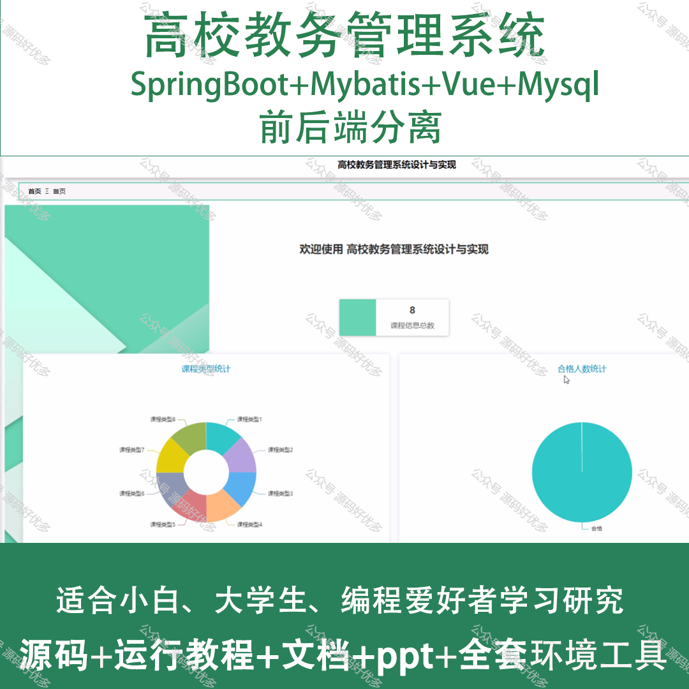
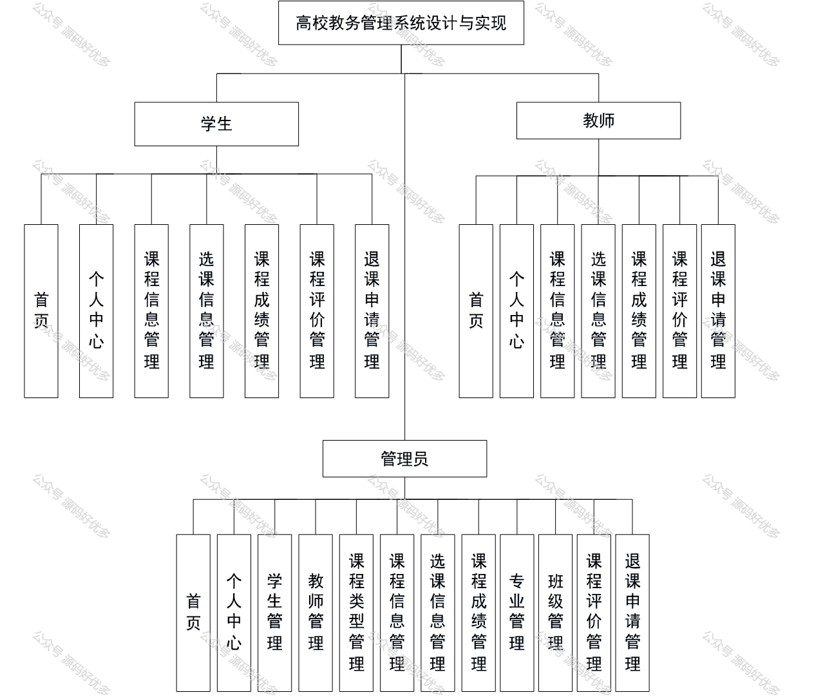
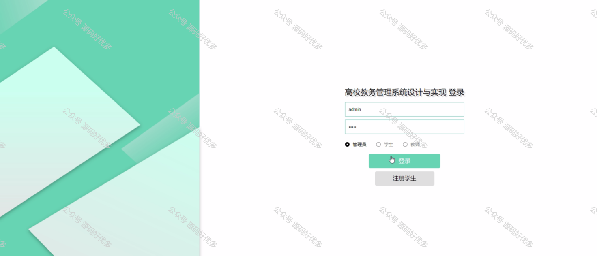
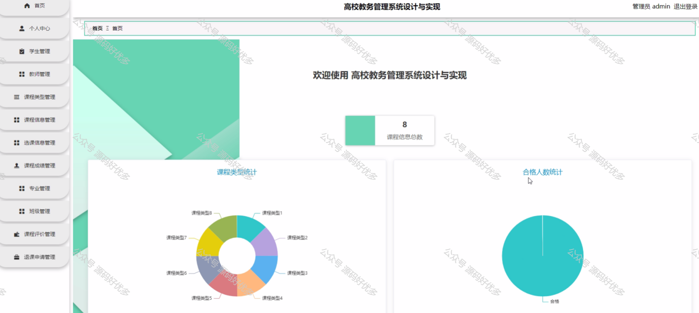
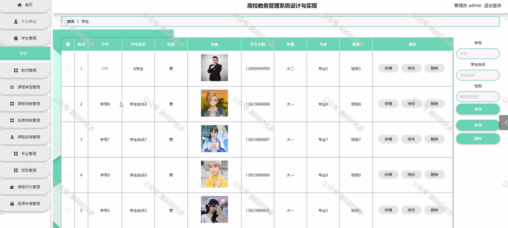
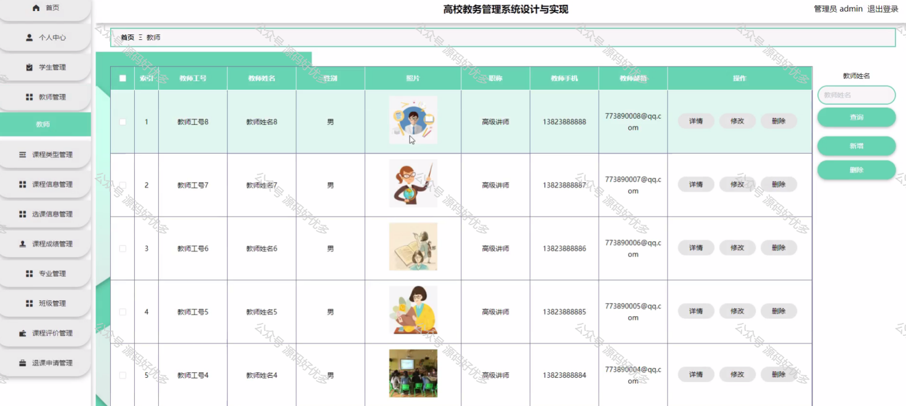
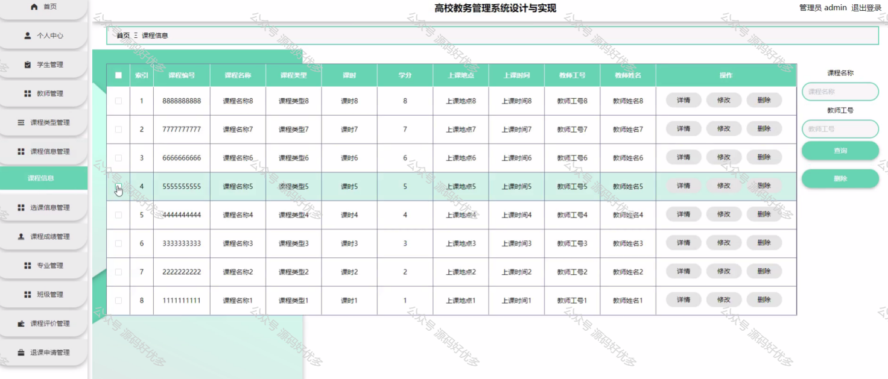
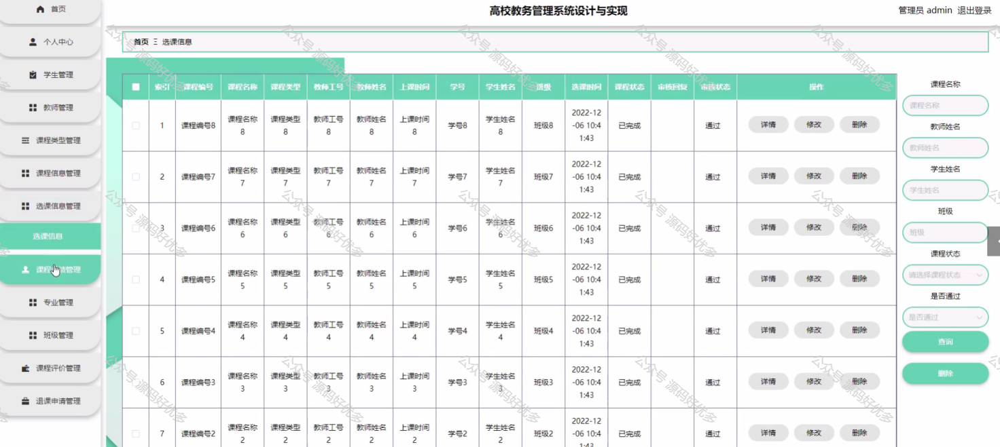
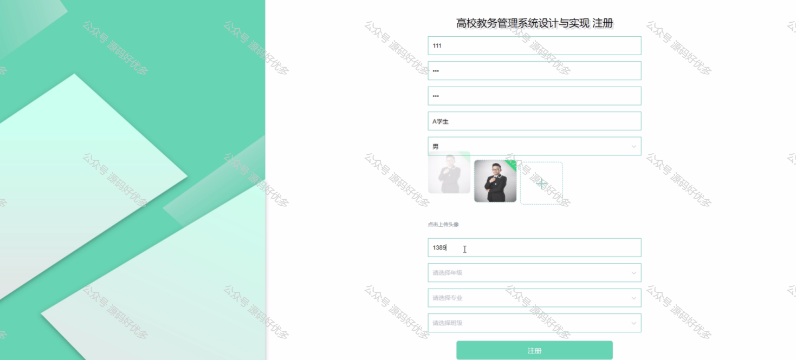
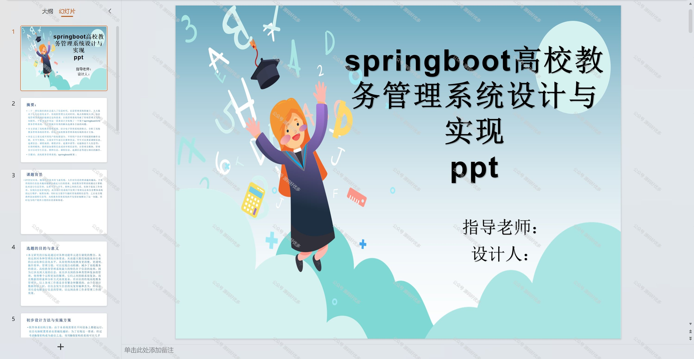
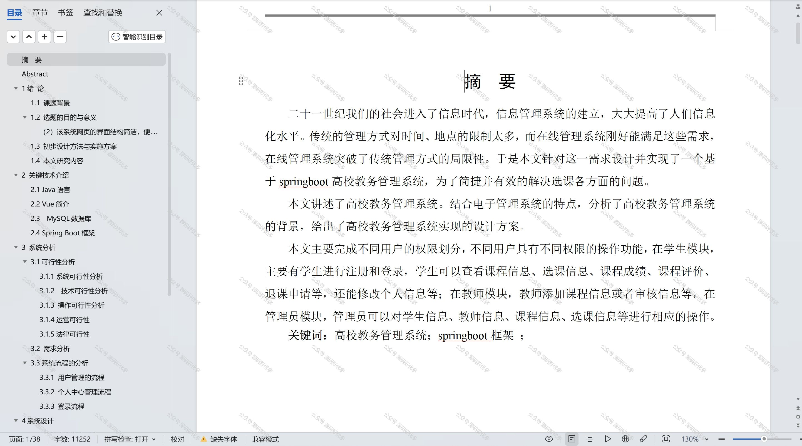

  
